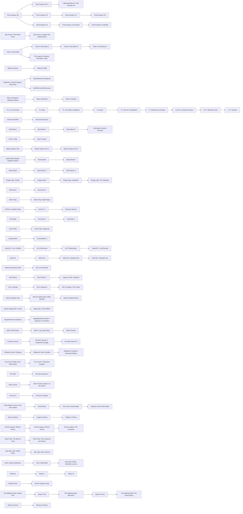

# Games Path

```mermaid
graph LR
    %% Final Fantasy series
    FF13[Final Fantasy XIII] --> FF13_2[Final Fantasy XIII-2]
    FF13_2 --> LRFF13[Lightning Returns: Final Fantasy XIII]
    FF13 --> FF14[Final Fantasy XIV]
    FF14 --> FF15[Final Fantasy XV]
    FF15 --> FF16[Final Fantasy XVI]
    FF13 --> FF7[Final Fantasy VII]
    FF7 --> FF7R[Final Fantasy VII Remake]
    FF7R --> FF7RB[Final Fantasy VII Rebirth]

    %% Star Ocean series
    SO_DF[Star Ocean: The Divine Force] --> SO5[Star Ocean: Integrity and Faithlessness]

    %% Trails series
    TOCS[Trails of Cold Steel] --> TOCS2[Trails of Cold Steel II]
    TOCS2 --> TOCS3[Trails of Cold Steel III]
    TOCS3 --> TOCS4[Trails of Cold Steel IV]
    TOCS --> Nayuta[The Legend of Nayuta: Boundless Trails]

    %% Valkyrie series
    VE[Valkyrie Elysium] --> VP1[Valkyrie Profile]

    %% Neptunia crossover
    NSK[Neptunia x Senran Kagura: Ninja Wars] --> Neptunia[Hyperdimension Neptunia]
    NSK --> Senran[SENRAN KAGURA series]

    %% Tales series
    ToV[Tales of Vesperia: Definitive Edition] --> ToB[Tales of Berseria]
    ToB --> ToZ[Tales of Zestiria]

    %% Ys series
    Ys1[Ys I & II Chronicles] --> YsO[Ys Origin]
    YsO --> YsF[Ys: The Oath in Felghana]
    YsF --> Ys7[Ys Seven]
    Ys7 --> YsAN[Ys: The Ark of Napishtim]
    YsAN --> YsMC[Ys: Memories of Celceta]
    YsMC --> Ys8[Ys VIII: Lacrimosa of Dana]
    Ys8 --> Ys9[Ys IX: Monstrum Nox]
    Ys9 --> Ys10[Ys X: Nordics]

    %% Salt and Sacrifice series
    SaS[Salt and Sacrifice] --> SoS[Salt and Sanctuary]

    %% Momodora series
    MM1[Momodora I] --> MM2[Momodora II]
    MM2 --> MM3[Momodora III]
    MM3 --> MMF[Momodora: Moonlit Farewell]
    
    %% Axiom Verge series
    AV1[Axiom Verge] --> AV2[Axiom Verge 2]

    %% Blaster Master Zero trilogy
    BMZ1[Blaster Master Zero] --> BMZ2[Blaster Master Zero 2]
    BMZ2 --> BMZ3[Blaster Master Zero 3]

    %% Dead Island series
    DI_R[Dead Island Riptide: Definitive Edition] --> DI1[Dead Island]
    DI1 --> DI2[Dead Island 2]

    %% Dead Space series
    DS1[Dead Space] --> DS2[Dead Space 2]
    DS2 --> DS3[Dead Space 3]

    %% Dragon Age series
    DA1[Dragon Age: Origins] --> DA2[Dragon Age II]
    DA2 --> DA3[Dragon Age: Inquisition]
    DA3 --> DA4[Dragon Age: The Veilguard]

    %% Dusk Diver series
    DD1[Dusk Diver] --> DD2[Dusk Diver 2]

    %% Elden Ring DLC
    ER[Elden Ring] --> ER_NR[Elden Ring: Night Reign]

    %% Gal*Gun series
    GG_DP[Gal*Gun: Double Peace] --> GG2[Gal*Gun 2]
    GG2 --> GGR[Gal*Gun Returns]

    %% God Eater series
    GE1[God Eater] --> GE2[God Eater 2]
    GE2 --> GE3[God Eater 3]

    %% God of War saga
    GoW2018[God of War] --> GoW_R[God of War: Ragnarok]

    %% Guacamelee series
    G1[Guacamelee!] --> G2[Guacamelee! 2]

    %% .hack//G.U. series
    GU1[.hack//G.U. Vol.1 Rebirth] --> GU2[Vol.2 Reminisce]
    GU2 --> GU3[Vol.3 Redemption]
    GU3 --> GULR[.hack//G.U. Last Recode]

    %% Half-Life series
    HL1[Half-Life] --> HL2[Half-Life 2]
    HL2 --> HL2_EP1[Half-Life 2: Episode One]
    HL2_EP1 --> HL2_EP2[Half-Life 2: Episode Two]

    %% Katamari series
    KD[Katamari Damacy Reroll] --> WLK[We Love Katamari]

    %% Soul Reaver series
    SR1[Soul Reaver] --> SR2[Soul Reaver 2]
    SR2 --> Defiance[Legacy of Kain: Defiance]

    %% Life is Strange series
    LIS1[Life is Strange] --> LIS2[Life is Strange 2]
    LIS2 --> LIS_TC[Life is Strange: True Colors]

    %% Spider-Man saga
    SM[Marvel’s Spider-Man] --> SMM[Marvel’s Spider-Man: Miles Morales]
    SMM --> SM2[Marvel’s Spider-Man 2]

    %% Mega Man X lineage
    MMX[Classic Mega Man X series] --> MMX_Dive[Mega Man X Dive Offline]

    %% Neptunia spin-off
    HN[Hyperdimension Neptunia] --> MBZ[Megatagmension Blanc + Neptune VS Zombies]

    %% Metro series
    M2033[Metro 2033 Redux] --> MLL[Metro: Last Light Redux]
    MLL --> ME[Metro Exodus]

    %% No More Heroes saga
    NMH1[No More Heroes] --> NMH2[No More Heroes 2: Desperate Struggle]
    NMH2 --> NMH3[No More Heroes III]

    %% Oddworld series
    AO[Oddworld: Abe’s Oddysee] --> AE[Oddworld: Abe’s Exoddus]
    AE --> OS[Oddworld: Soulstorm Enhanced Edition]

    %% Ni no Kuni series
    NNK1[Ni no Kuni: Wrath of the White Witch] --> NNK2[Ni no Kuni II: Revenant Kingdom]

    %% Pac-Man collection
    PM[Pac-Man] --> PMM[Pac-Man Museum+]

    %% Path of Exile expansions
    PoE[Path of Exile] --> PoE_KF[Path of Exile: Keepers of the Flame]

    %% Persona 5 lineage
    P5[Persona 5] --> P5S[Persona 5 Strikers]

    %% Tomb Raider saga
    TR_GOTY[Tomb Raider: Game of the Year Edition] --> TR2013[Tomb Raider]
    TR2013 --> TR_Rise[Rise of the Tomb Raider]
    TR_Rise --> TR_Shadow[Shadow of the Tomb Raider]

    %% Secret of Mana series
    SoM[Secret of Mana] --> LoM[Legend of Mana]
    LoM --> CoM[Children of Mana]

    %% Senran Kagura series
    SK_SV[Senran Kagura: Shinovi Versus] --> SK_EV[Senran Kagura: Estival Versus]
    SK_EV --> SK_AN[Senran Kagura: The Animation]

    %% South Park RPGs
    SP_ST[South Park: The Stick of Truth] --> SP_FB[South Park: The Fractured But Whole]

    %% Star Wars Jedi saga
    SW_FO[Star Wars Jedi: Fallen Order] --> SW_S[Star Wars Jedi: Survivor]

    %% Sword Art Online series
    SAO[SAO: Hollow Realization] --> SAO_F[SAO: Fatal Bullet]
    SAO_F --> SAO_AL[Sword Art Online: Alicization Lycoris]

    %% Tekken series
    T6[Tekken 6] --> T7[Tekken 7]
    T7 --> T8[Tekken 8]

    %% Valkyrie Drive spin-off
    VD[Valkyrie Drive] --> SK[Senran Kagura series]

    %% The Walking Dead series
    WD1[The Walking Dead: Season One] --> WD2[Season Two]
    WD2 --> WD_M[The Walking Dead: Michonne]
    WD_M --> WD3[Season Three]
    WD3 --> WDF[The Walking Dead: The Final Season]

    %% Warriors crossover
    WO[Warriors Orochi] --> WA[Warriors All-Stars]

```